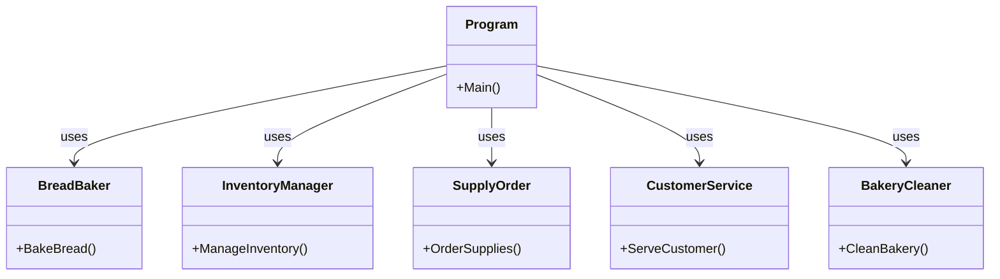
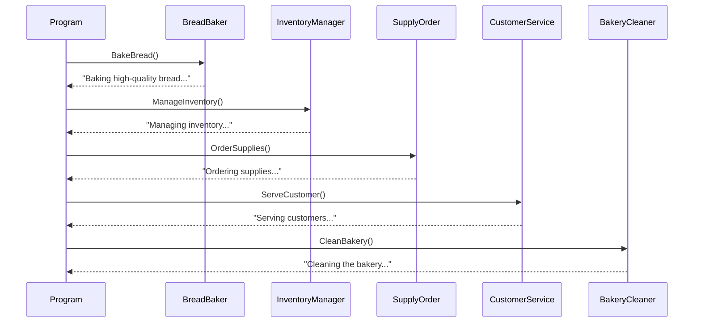
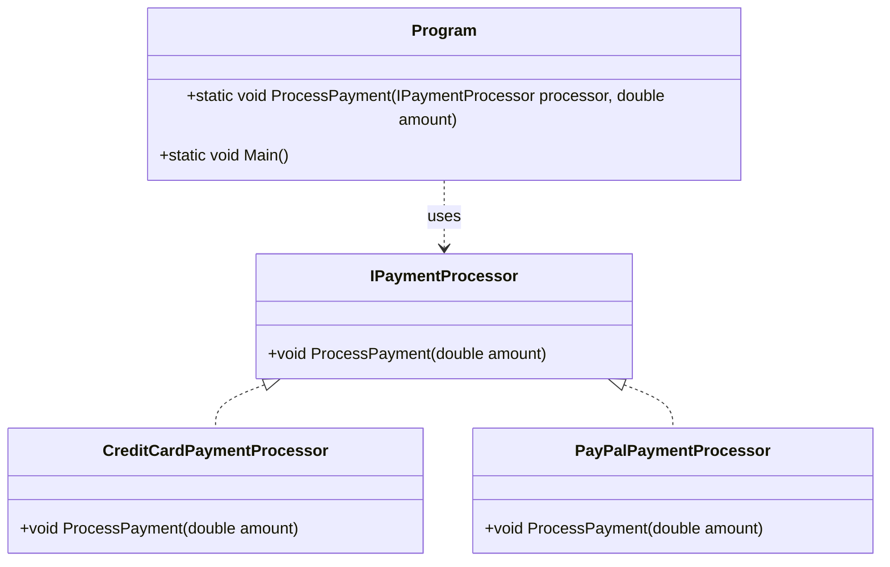
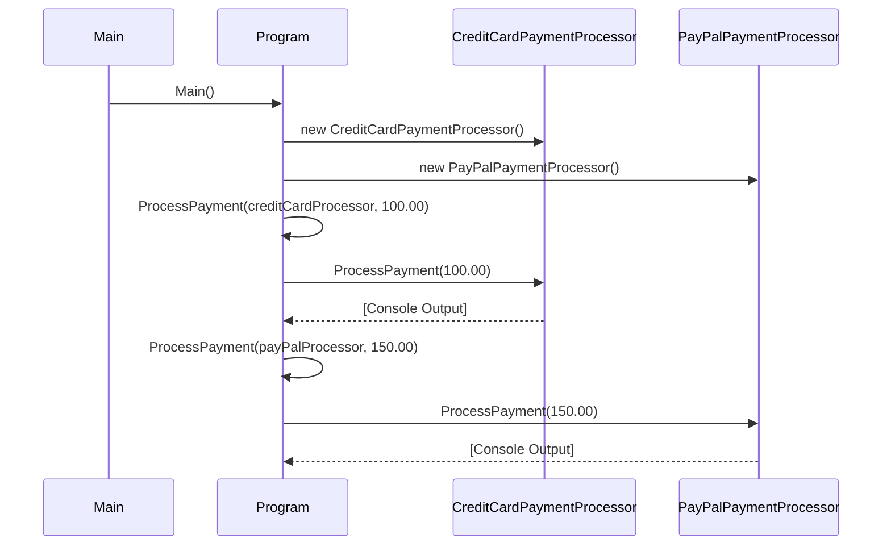

# SOLID

## 1. Single Responsibility Principle(Bakery Example)

**A class should have only one reason to change**

### Class Diagram



### Sequence Diagram



```csharp
using System;

// Class for baking bread
public class BreadBaker
{
    public void BakeBread()
    {
        Console.WriteLine("Baking high-quality bread...");
    }
}

// Class for managing inventory
public class InventoryManager
{
    public void ManageInventory()
    {
        Console.WriteLine("Managing inventory...");
    }
}

// Class for ordering supplies
public class SupplyOrder
{
    public void OrderSupplies()
    {
        Console.WriteLine("Ordering supplies...");
    }
}

// Class for serving customers
public class CustomerService
{
    public void ServeCustomer()
    {
        Console.WriteLine("Serving customers...");
    }
}

// Class for cleaning the bakery
public class BakeryCleaner
{
    public void CleanBakery()
    {
        Console.WriteLine("Cleaning the bakery...");
    }
}

class Program
{
    static void Main()
    {
        var baker = new BreadBaker();
        var inventoryManager = new InventoryManager();
        var supplyOrder = new SupplyOrder();
        var customerService = new CustomerService();
        var cleaner = new BakeryCleaner();
        
        // Each class focuses on its specific responsibility
        baker.BakeBread();
        inventoryManager.ManageInventory();
        supplyOrder.OrderSupplies();
        customerService.ServeCustomer();
        cleaner.CleanBakery();
    }
}
```

## 2. Open/Closed Principle (Payment Processor Example)

**Software entities (classes, modules, functions, etc.) should be open for extension, but closed for modification**

### Class Diagram



### Sequence Diagram



```csharp
using System;

// Base interface for payment processing
public interface IPaymentProcessor
{
    void ProcessPayment(double amount);
}

// Credit card payment processor
public class CreditCardPaymentProcessor : IPaymentProcessor
{
    public void ProcessPayment(double amount)
    {
        Console.WriteLine($"Processing credit card payment of ${amount}");
    }
}

// PayPal payment processor
public class PayPalPaymentProcessor : IPaymentProcessor
{
    public void ProcessPayment(double amount)
    {
        Console.WriteLine($"Processing PayPal payment of ${amount}");
    }
}

class Program
{
    static void ProcessPayment(IPaymentProcessor processor, double amount)
    {
        processor.ProcessPayment(amount);
    }

    static void Main()
    {
        var creditCardProcessor = new CreditCardPaymentProcessor();
        var payPalProcessor = new PayPalPaymentProcessor();
        
        ProcessPayment(creditCardProcessor, 100.00);
        ProcessPayment(payPalProcessor, 150.00);
    }
}
```

## 3. Liskov's Substitution Principle (Rectangle/Square Example)

**Derived or child classes must be substitutable for their base or parent classes**

```csharp
using System;

// Base class for shapes
public class Rectangle
{
    protected double width;
    protected double height;

    public Rectangle(double w, double h)
    {
        width = w;
        height = h;
    }

    public virtual double Area()
    {
        return width * height;
    }

    public double GetWidth() => width;
    public double GetHeight() => height;

    public virtual void SetWidth(double w) => width = w;
    public virtual void SetHeight(double h) => height = h;
}

// Derived class for squares
public class Square : Rectangle
{
    public Square(double size) : base(size, size) { }

    public override void SetWidth(double w)
    {
        width = height = w; // Ensure both width and height remain same
    }

    public override void SetHeight(double h)
    {
        height = width = h; // Ensure both width and height remain same
    }
}

class Program
{
    static void Main()
    {
        Rectangle rect = new Rectangle(5, 4);
        Console.WriteLine($"Rectangle area: {rect.Area()}"); // 20
        
        Square square = new Square(5);
        Console.WriteLine($"Square area: {square.Area()}"); // 25
        
        // LSP violation demonstration
        Rectangle rectAsSquare = new Square(5);
        rectAsSquare.SetWidth(4);
        Console.WriteLine($"Area after setting width: {rectAsSquare.Area()}"); // 16 (not 20 as expected for rectangle)
    }
}
```

## 4. Interface Segregation Principle (Restaurant Menu Example)

**Do not force any client to implement an interface which is irrelevant to them.**

```csharp
using System;
using System.Collections.Generic;

// Interface for vegetarian menu
public interface IVegetarianMenu
{
    List<string> GetVegetarianItems();
}

// Interface for non-vegetarian menu
public interface INonVegetarianMenu
{
    List<string> GetNonVegetarianItems();
}

// Interface for drinks menu
public interface IDrinkMenu
{
    List<string> GetDrinkItems();
}

// Class for vegetarian menu
public class VegetarianMenu : IVegetarianMenu
{
    public List<string> GetVegetarianItems()
    {
        return new List<string> { "Vegetable Curry", "Paneer Tikka", "Salad" };
    }
}

// Class for non-vegetarian menu
public class NonVegetarianMenu : INonVegetarianMenu
{
    public List<string> GetNonVegetarianItems()
    {
        return new List<string> { "Chicken Curry", "Fish Fry", "Mutton Biryani" };
    }
}

// Class for drinks menu
public class DrinkMenu : IDrinkMenu
{
    public List<string> GetDrinkItems()
    {
        return new List<string> { "Water", "Soda", "Juice" };
    }
}

class Program
{
    static void DisplayVegetarianMenu(IVegetarianMenu menu)
    {
        Console.WriteLine("Vegetarian Menu:");
        foreach (var item in menu.GetVegetarianItems())
        {
            Console.WriteLine($"- {item}");
        }
    }

    static void DisplayNonVegetarianMenu(INonVegetarianMenu menu)
    {
        Console.WriteLine("Non-Vegetarian Menu:");
        foreach (var item in menu.GetNonVegetarianItems())
        {
            Console.WriteLine($"- {item}");
        }
    }

    static void Main()
    {
        var vegMenu = new VegetarianMenu();
        var nonVegMenu = new NonVegetarianMenu();
        var drinkMenu = new DrinkMenu();
        
        DisplayVegetarianMenu(vegMenu);
        DisplayNonVegetarianMenu(nonVegMenu);
    }
}
```

## 5. Dependency Inversion Principle (Version Control Example)

**High-level modules should not depend on low-level modules. Both should depend on abstractions**

```csharp
using System;

// Interface for version control system
public interface IVersionControl
{
    void Commit(string message);
    void Push();
    void Pull();
}

// Git version control implementation
public class GitVersionControl : IVersionControl
{
    public void Commit(string message)
    {
        Console.WriteLine($"Committing changes to Git with message: {message}");
    }

    public void Push()
    {
        Console.WriteLine("Pushing changes to remote Git repository.");
    }

    public void Pull()
    {
        Console.WriteLine("Pulling changes from remote Git repository.");
    }
}

// Team class that relies on version control
public class DevelopmentTeam
{
    private readonly IVersionControl _versionControl;

    public DevelopmentTeam(IVersionControl versionControl)
    {
        _versionControl = versionControl;
    }

    public void MakeCommit(string message)
    {
        _versionControl.Commit(message);
    }

    public void PerformPush()
    {
        _versionControl.Push();
    }

    public void PerformPull()
    {
        _versionControl.Pull();
    }
}

class Program
{
    static void Main()
    {
        var git = new GitVersionControl();
        var team = new DevelopmentTeam(git);
        
        team.MakeCommit("Initial commit");
        team.PerformPush();
        team.PerformPull();
    }
}
```
