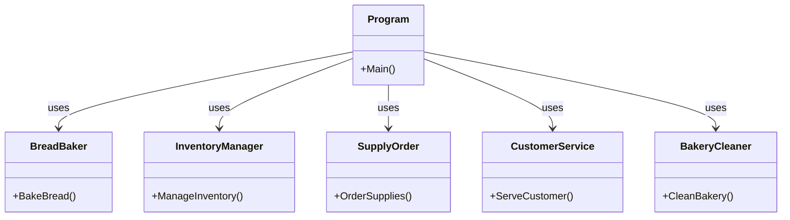
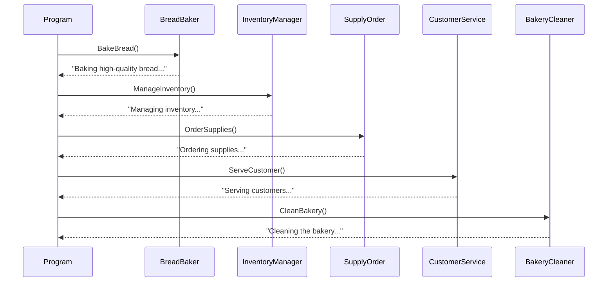
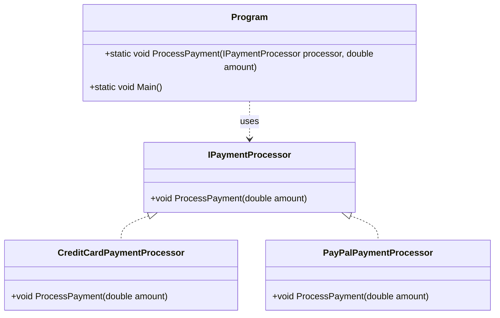
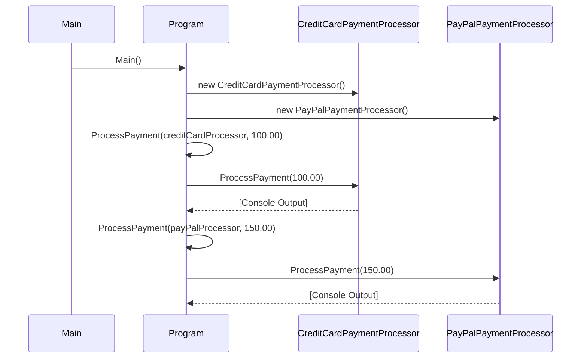
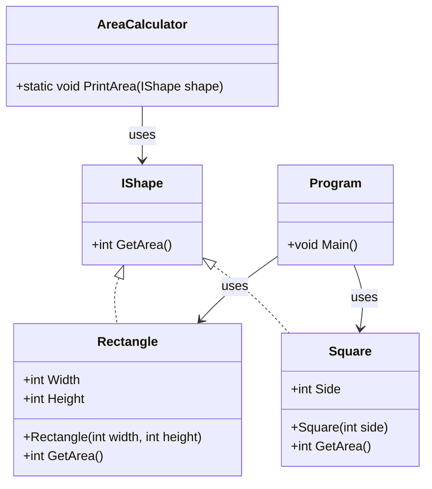
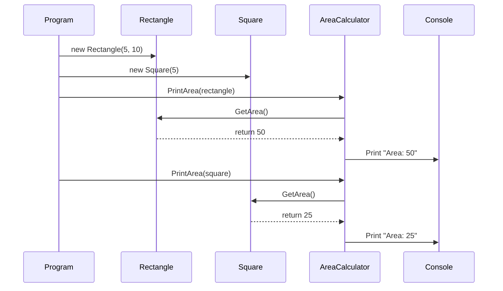
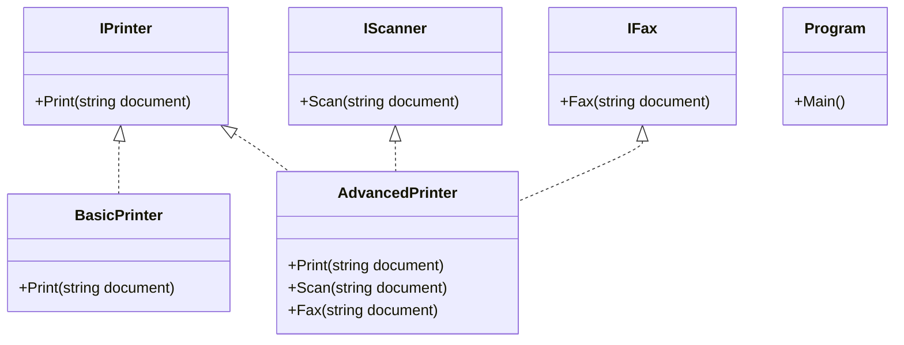
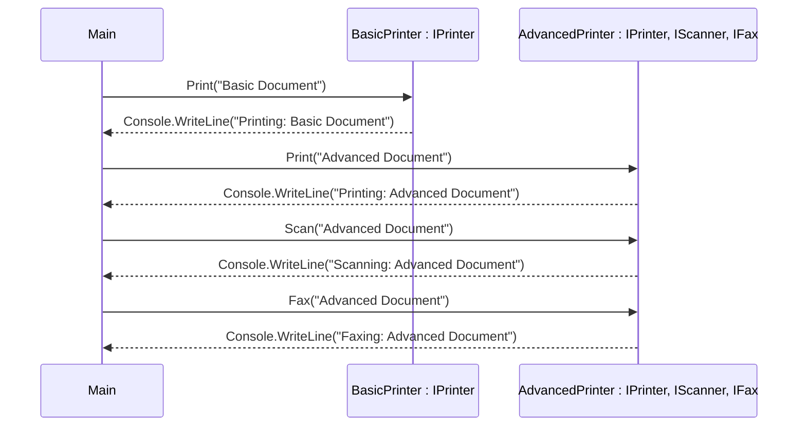
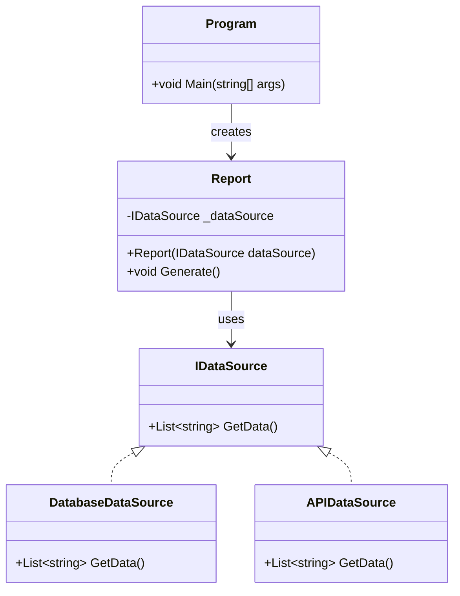
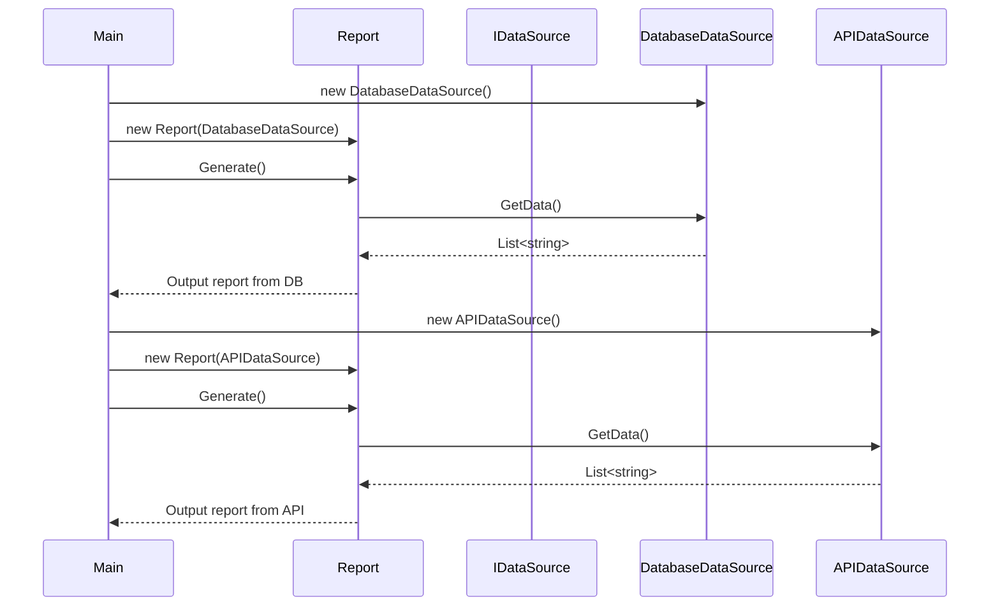

# SOLID

## 1. Single Responsibility Principle

**A class should have only one reason to change**

### C# Code Example (Anti-SRP)

```csharp
using System;

// This class does too many things and violates the Single Responsibility Principle
public class BakeryManager
{
    public void BakeBread()
    {
        Console.WriteLine("Baking high-quality bread...");
    }

    public void ManageInventory()
    {
        Console.WriteLine("Managing inventory...");
    }

    public void OrderSupplies()
    {
        Console.WriteLine("Ordering supplies...");
    }

    public void ServeCustomer()
    {
        Console.WriteLine("Serving customers...");
    }

    public void CleanBakery()
    {
        Console.WriteLine("Cleaning the bakery...");
    }
}

class Program
{
    static void Main()
    {
        var manager = new BakeryManager();

        // One class is handling all responsibilities
        manager.BakeBread();
        manager.ManageInventory();
        manager.OrderSupplies();
        manager.ServeCustomer();
        manager.CleanBakery();
    }
}
```

### C# Code Solution (SRP)


```csharp
using System;

// Class for baking bread
public class BreadBaker
{
    public void BakeBread()
    {
        Console.WriteLine("Baking high-quality bread...");
    }
}

// Class for managing inventory
public class InventoryManager
{
    public void ManageInventory()
    {
        Console.WriteLine("Managing inventory...");
    }
}

// Class for ordering supplies
public class SupplyOrder
{
    public void OrderSupplies()
    {
        Console.WriteLine("Ordering supplies...");
    }
}

// Class for serving customers
public class CustomerService
{
    public void ServeCustomer()
    {
        Console.WriteLine("Serving customers...");
    }
}

// Class for cleaning the bakery
public class BakeryCleaner
{
    public void CleanBakery()
    {
        Console.WriteLine("Cleaning the bakery...");
    }
}

class Program
{
    static void Main()
    {
        var baker = new BreadBaker();
        var inventoryManager = new InventoryManager();
        var supplyOrder = new SupplyOrder();
        var customerService = new CustomerService();
        var cleaner = new BakeryCleaner();
        
        // Each class focuses on its specific responsibility
        baker.BakeBread();
        inventoryManager.ManageInventory();
        supplyOrder.OrderSupplies();
        customerService.ServeCustomer();
        cleaner.CleanBakery();
    }
}
```

### Class Diagram



### Sequence Diagram



## 2. Open/Closed Principle

**Software entities (classes, modules, functions, etc.) should be open for extension, but closed for modification**

### C# Code Example (Anti-OCP)

```csharp
using System;

public class PaymentProcessor
{
    public void ProcessPayment(string paymentType, double amount)
    {
        if (paymentType == "creditcard")
        {
            Console.WriteLine($"Processing credit card payment of ${amount}");
        }
        else if (paymentType == "paypal")
        {
            Console.WriteLine($"Processing PayPal payment of ${amount}");
        }
        else
        {
            Console.WriteLine("Unsupported payment method");
        }
    }
}

class Program
{
    static void Main()
    {
        var processor = new PaymentProcessor();
        
        processor.ProcessPayment("creditcard", 100.00);
        processor.ProcessPayment("paypal", 150.00);
    }
}
```

### C# Code Solution (OCP)

```csharp
using System;

// Base interface for payment processing
public interface IPaymentProcessor
{
    void ProcessPayment(double amount);
}

// Credit card payment processor
public class CreditCardPaymentProcessor : IPaymentProcessor
{
    public void ProcessPayment(double amount)
    {
        Console.WriteLine($"Processing credit card payment of ${amount}");
    }
}

// PayPal payment processor
public class PayPalPaymentProcessor : IPaymentProcessor
{
    public void ProcessPayment(double amount)
    {
        Console.WriteLine($"Processing PayPal payment of ${amount}");
    }
}

class Program
{
    static void ProcessPayment(IPaymentProcessor processor, double amount)
    {
        processor.ProcessPayment(amount);
    }

    static void Main()
    {
        var creditCardProcessor = new CreditCardPaymentProcessor();
        var payPalProcessor = new PayPalPaymentProcessor();
        
        ProcessPayment(creditCardProcessor, 100.00);
        ProcessPayment(payPalProcessor, 150.00);
    }
}
```

### Class Diagram



### Sequence Diagram



## 3. Liskov's Substitution Principle

**Derived or child classes must be substitutable for their base or parent classes**

### C# Code Example (Anti-LSP)

```csharp
using System;

namespace AntiLSPExample
{
    // Rectangle class
    public class Rectangle
    {
        public virtual int Width { get; set; }
        public virtual int Height { get; set; }

        public int GetArea()
        {
            return Width * Height;
        }
    }

    // Square inherits from Rectangle (Anti-LSP)
    public class Square : Rectangle
    {
        public override int Width
        {
            get { return base.Width; }
            set
            {
                base.Width = value;
                base.Height = value; // Side effect: changing Width also changes Height
            }
        }

        public override int Height
        {
            get { return base.Height; }
            set
            {
                base.Height = value;
                base.Width = value; // Side effect: changing Height also changes Width
            }
        }
    }

    // A utility class to demonstrate LSP violation
    public class AreaCalculator
    {
        public static void PrintArea(Rectangle rectangle)
        {
            rectangle.Width = 5;
            rectangle.Height = 10;

            // Expected: 5 * 10 = 50
            // But if rectangle is actually a Square, it will be 10 * 10 = 100
            Console.WriteLine("Area: " + rectangle.GetArea());
        }
    }

    // Test the Anti-LSP scenario
    class Program
    {
        static void Main(string[] args)
        {
            Rectangle rectangle = new Rectangle();
            Square square = new Square();

            AreaCalculator.PrintArea(rectangle); // Output: Area: 50
            AreaCalculator.PrintArea(square);    // Output: Area: 100 (unexpected!)
        }
    }
}
```

### C# Code Solution (LSP)

```csharp
using System;

namespace LSPExample
{
    // Interface that both shapes will implement
    public interface IShape
    {
        int GetArea();
    }

    // Rectangle implementation
    public class Rectangle : IShape
    {
        public int Width { get; set; }
        public int Height { get; set; }

        public Rectangle(int width, int height)
        {
            Width = width;
            Height = height;
        }

        public int GetArea()
        {
            return Width * Height;
        }
    }

    // Square implementation using composition, not inheritance
    public class Square : IShape
    {
        public int Side { get; set; }

        public Square(int side)
        {
            Side = side;
        }

        public int GetArea()
        {
            return Side * Side;
        }
    }

    // A utility class to demonstrate LSP
    public class AreaCalculator
    {
        public static void PrintArea(IShape shape)
        {
            Console.WriteLine("Area: " + shape.GetArea());
        }
    }

    // Test the implementation
    class Program
    {
        static void Main(string[] args)
        {
            IShape rectangle = new Rectangle(5, 10);
            IShape square = new Square(5);

            AreaCalculator.PrintArea(rectangle); // Output: Area: 50
            AreaCalculator.PrintArea(square);    // Output: Area: 25
        }
    }
}
```

### Class Diagram



### Sequence Diagram



## 4. Interface Segregation Principle

**Do not force any client to implement an interface which is irrelevant to them.**

### Class Diagram



### Sequence Diagram



```csharp
using System;

public interface IPrinter
{
    void Print(string document);
}

public interface IScanner
{
    void Scan(string document);
}

public interface IFax
{
    void Fax(string document);
}

// BasicPrinter implements only what it needs (IPrinter)
public class BasicPrinter : IPrinter
{
    public void Print(string document)
    {
        Console.WriteLine($"Printing: {document}");
    }
}

// AdvancedPrinter implements all capabilities
public class AdvancedPrinter : IPrinter, IScanner, IFax
{
    public void Print(string document)
    {
        Console.WriteLine($"Printing: {document}");
    }

    public void Scan(string document)
    {
        Console.WriteLine($"Scanning: {document}");
    }

    public void Fax(string document)
    {
        Console.WriteLine($"Faxing: {document}");
    }
}

// Example usage
class Program
{
    static void Main()
    {
        IPrinter basicPrinter = new BasicPrinter();
        basicPrinter.Print("Basic Document");

        AdvancedPrinter advancedPrinter = new AdvancedPrinter();
        advancedPrinter.Print("Advanced Document");
        advancedPrinter.Scan("Advanced Document");
        advancedPrinter.Fax("Advanced Document");
    }
}
```

## 5. Dependency Inversion Principle

**High-level modules should not depend on low-level modules. Both should depend on abstractions**

### C# Code Example (Anti-DIP)

```csharp
using System;
using System.Collections.Generic;

// 1. Low-level module: Database data source
public class DatabaseDataSource
{
    public List<string> GetData()
    {
        // Simulate fetching data from a database
        return new List<string> { "DB Record 1", "DB Record 2", "DB Record 3" };
    }
}

// 2. Low-level module: API data source
public class APIDataSource
{
    public List<string> GetData()
    {
        // Simulate fetching data from an API
        return new List<string> { "API Data 1", "API Data 2" };
    }
}

// 3. High-level module: Report class (tightly coupled to low-level modules)
public class Report
{
    private readonly DatabaseDataSource _dbSource;
    private readonly APIDataSource _apiSource;

    public Report()
    {
        // Direct instantiation (tight coupling)
        _dbSource = new DatabaseDataSource();
        _apiSource = new APIDataSource();
    }

    public void GenerateFromDatabase()
    {
        List<string> data = _dbSource.GetData();
        Console.WriteLine("Report from Database:");
        foreach (string item in data)
        {
            Console.WriteLine($"- {item}");
        }
    }

    public void GenerateFromAPI()
    {
        List<string> data = _apiSource.GetData();
        Console.WriteLine("Report from API:");
        foreach (string item in data)
        {
            Console.WriteLine($"- {item}");
        }
    }
}

// 4. Program entry point
public class Program
{
    public static void Main(string[] args)
    {
        Report report = new Report();

        report.GenerateFromDatabase();
        Console.WriteLine();
        report.GenerateFromAPI();
    }
}
```

### C# Code Solution (DIP)

```csharp
using System;
using System.Collections.Generic;

// 1. The abstraction
public interface IDataSource
{
    List<string> GetData();
}

// 2. Low-level module: Database data source
public class DatabaseDataSource : IDataSource
{
    public List<string> GetData()
    {
        // Simulate fetching data from a database
        return new List<string> { "DB Record 1", "DB Record 2", "DB Record 3" };
    }
}

// 3. Low-level module: API data source
public class APIDataSource : IDataSource
{
    public List<string> GetData()
    {
        // Simulate fetching data from an API
        return new List<string> { "API Data 1", "API Data 2" };
    }
}

// 4. High-level module: Report class
public class Report
{
    private readonly IDataSource _dataSource;

    // Dependency Injection via constructor
    public Report(IDataSource dataSource)
    {
        _dataSource = dataSource;
    }

    public void Generate()
    {
        List<string> data = _dataSource.GetData();
        Console.WriteLine("Report Content:");
        foreach (string item in data)
        {
            Console.WriteLine($"- {item}");
        }
    }
}

// 5. Program entry point
public class Program
{
    public static void Main(string[] args)
    {
        // Easily switch data sources here
        IDataSource dbSource = new DatabaseDataSource();
        IDataSource apiSource = new APIDataSource();

        Console.WriteLine("Using DatabaseDataSource:");
        Report reportFromDb = new Report(dbSource);
        reportFromDb.Generate();

        Console.WriteLine("\nUsing APIDataSource:");
        Report reportFromApi = new Report(apiSource);
        reportFromApi.Generate();
    }
}
```

### Class Diagram



### Sequence Diagram




