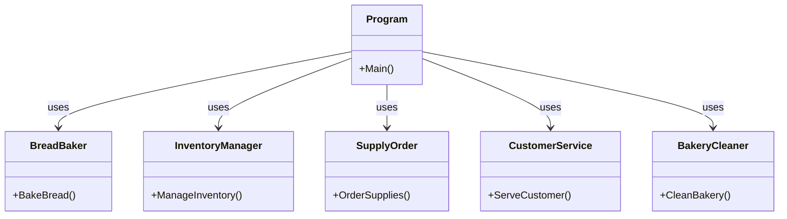
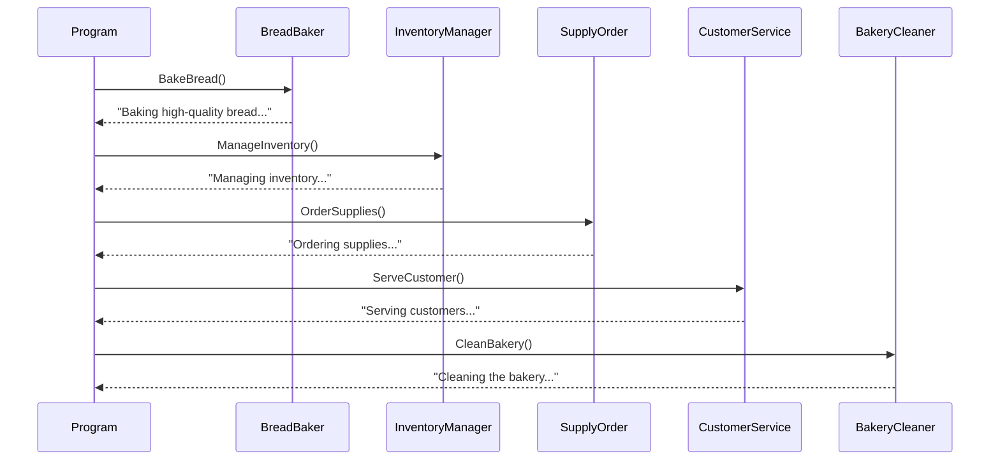

### Class Diagram

```mermaid
classDiagram
    class BreadBaker {
        +BakeBread()
    }

    class InventoryManager {
        +ManageInventory()
    }

    class SupplyOrder {
        +OrderSupplies()
    }

    class CustomerService {
        +ServeCustomer()
    }

    class BakeryCleaner {
        +CleanBakery()
    }

    class Program {
        +Main()
    }

    Program --> BreadBaker : uses
    Program --> InventoryManager : uses
    Program --> SupplyOrder : uses
    Program --> CustomerService : uses
    Program --> BakeryCleaner : uses
```

### Sequence Diagram

```mermaid
sequenceDiagram
    participant Program
    participant BreadBaker
    participant InventoryManager
    participant SupplyOrder
    participant CustomerService
    participant BakeryCleaner

    Program->>BreadBaker: BakeBread()
    BreadBaker-->>Program: "Baking high-quality bread..."

    Program->>InventoryManager: ManageInventory()
    InventoryManager-->>Program: "Managing inventory..."

    Program->>SupplyOrder: OrderSupplies()
    SupplyOrder-->>Program: "Ordering supplies..."

    Program->>CustomerService: ServeCustomer()
    CustomerService-->>Program: "Serving customers..."

    Program->>BakeryCleaner: CleanBakery()
    BakeryCleaner-->>Program: "Cleaning the bakery..."
```