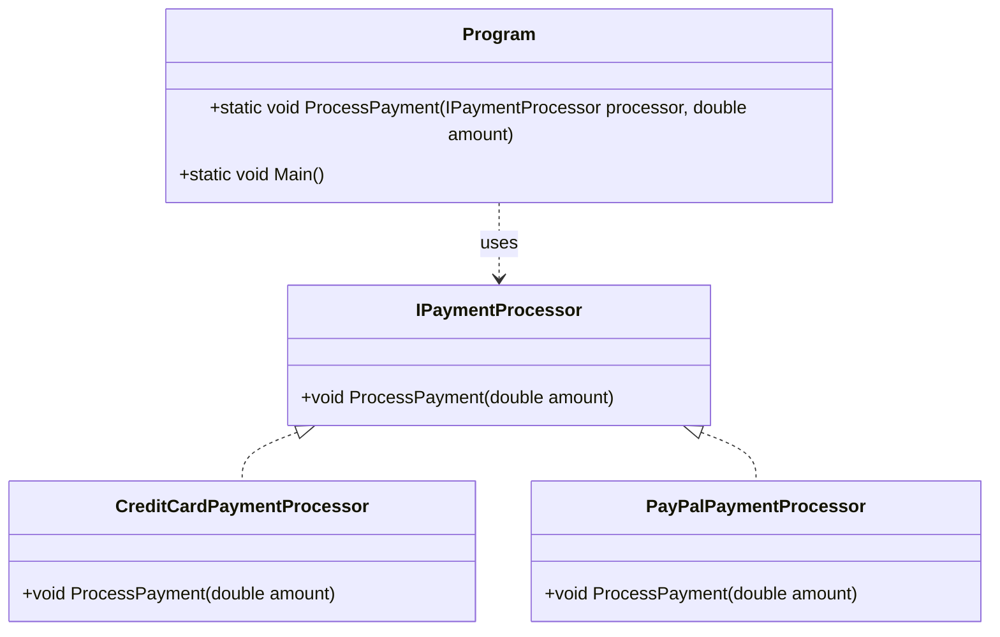
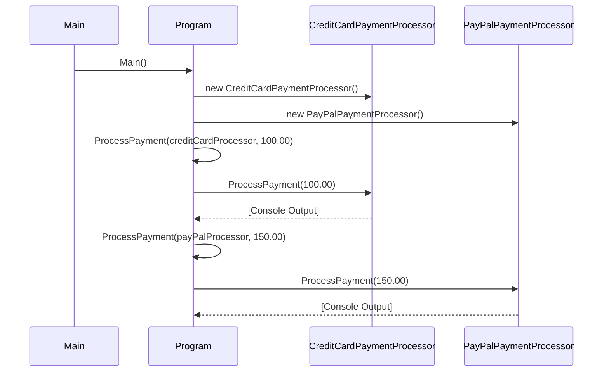

### Class Diagram

```mermaid
classDiagram
    class IPaymentProcessor {
        +void ProcessPayment(double amount)
    }

    class CreditCardPaymentProcessor {
        +void ProcessPayment(double amount)
    }

    class PayPalPaymentProcessor {
        +void ProcessPayment(double amount)
    }

    class Program {
        +static void ProcessPayment(IPaymentProcessor processor, double amount)
        +static void Main()
    }

    IPaymentProcessor <|.. CreditCardPaymentProcessor
    IPaymentProcessor <|.. PayPalPaymentProcessor
    Program ..> IPaymentProcessor : uses

```

### Sequence Diagram

```mermaid
sequenceDiagram
    participant Main
    participant Program
    participant CreditCardProcessor as CreditCardPaymentProcessor
    participant PayPalProcessor as PayPalPaymentProcessor

    Main->>Program: Main()
    Program->>CreditCardProcessor: new CreditCardPaymentProcessor()
    Program->>PayPalProcessor: new PayPalPaymentProcessor()

    Program->>Program: ProcessPayment(creditCardProcessor, 100.00)
    Program->>CreditCardProcessor: ProcessPayment(100.00)
    CreditCardProcessor-->>Program: [Console Output]

    Program->>Program: ProcessPayment(payPalProcessor, 150.00)
    Program->>PayPalProcessor: ProcessPayment(150.00)
    PayPalProcessor-->>Program: [Console Output]
```