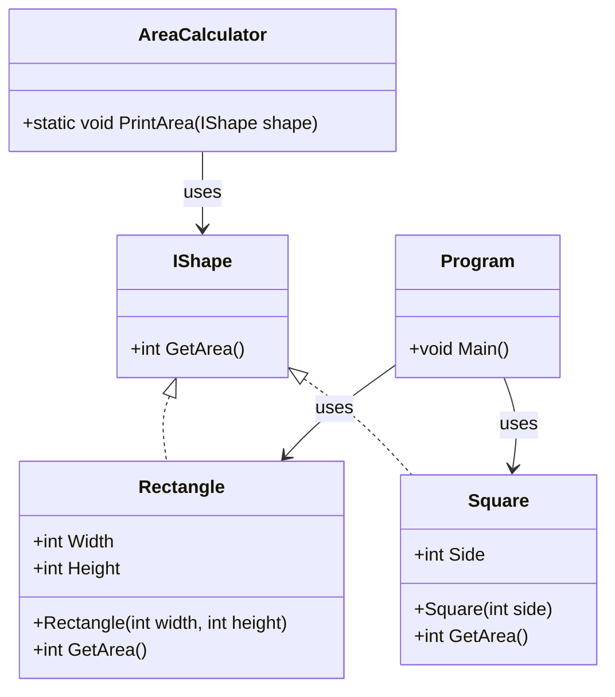
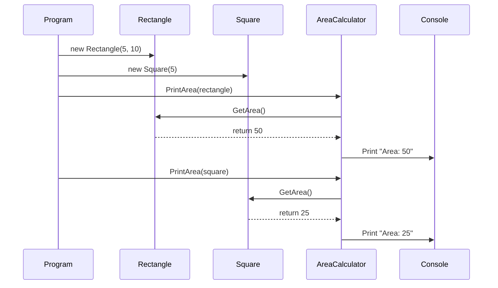

### Class Diagram

```mermaid
classDiagram
    class IShape {
        +int GetArea()
    }

    class Rectangle {
        +int Width
        +int Height
        +Rectangle(int width, int height)
        +int GetArea()
    }

    class Square {
        +int Side
        +Square(int side)
        +int GetArea()
    }

    class AreaCalculator {
        +static void PrintArea(IShape shape)
    }

    class Program {
        +void Main()
    }

    IShape <|.. Rectangle
    IShape <|.. Square
    Program --> Rectangle : uses
    Program --> Square : uses
    AreaCalculator --> IShape : uses
```

### Sequence Diagram

```mermaid
sequenceDiagram
    participant Program
    participant Rectangle
    participant Square
    participant AreaCalculator
    participant Console

    Program->>Rectangle: new Rectangle(5, 10)
    Program->>Square: new Square(5)

    Program->>AreaCalculator: PrintArea(rectangle)
    AreaCalculator->>Rectangle: GetArea()
    Rectangle-->>AreaCalculator: return 50
    AreaCalculator->>Console: Print "Area: 50"

    Program->>AreaCalculator: PrintArea(square)
    AreaCalculator->>Square: GetArea()
    Square-->>AreaCalculator: return 25
    AreaCalculator->>Console: Print "Area: 25"
```