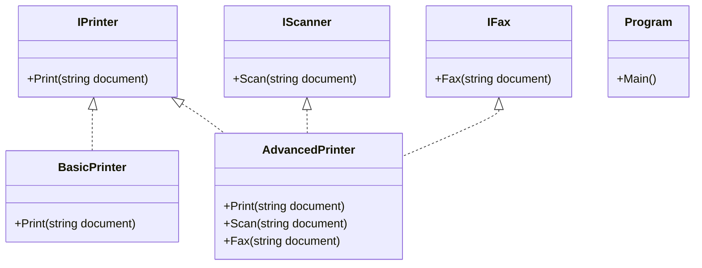
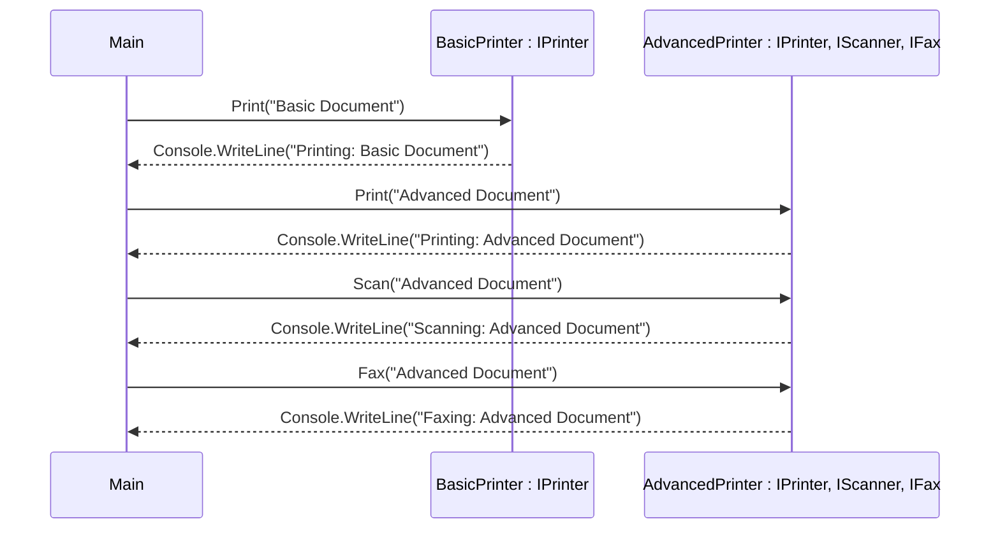

### Class Diagram

```mermaid
classDiagram
    class IPrinter {
        +Print(string document)
    }

    class IScanner {
        +Scan(string document)
    }

    class IFax {
        +Fax(string document)
    }

    class BasicPrinter {
        +Print(string document)
    }

    class AdvancedPrinter {
        +Print(string document)
        +Scan(string document)
        +Fax(string document)
    }

    class Program {
        +Main()
    }

    IPrinter <|.. BasicPrinter
    IPrinter <|.. AdvancedPrinter
    IScanner <|.. AdvancedPrinter
    IFax <|.. AdvancedPrinter
```

### Sequence Diagram

```mermaid
sequenceDiagram
    participant Main
    participant BasicPrinter as BasicPrinter : IPrinter
    participant AdvancedPrinter as AdvancedPrinter : IPrinter, IScanner, IFax

    Main->>BasicPrinter: Print("Basic Document")
    BasicPrinter-->>Main: Console.WriteLine("Printing: Basic Document")

    Main->>AdvancedPrinter: Print("Advanced Document")
    AdvancedPrinter-->>Main: Console.WriteLine("Printing: Advanced Document")

    Main->>AdvancedPrinter: Scan("Advanced Document")
    AdvancedPrinter-->>Main: Console.WriteLine("Scanning: Advanced Document")

    Main->>AdvancedPrinter: Fax("Advanced Document")
    AdvancedPrinter-->>Main: Console.WriteLine("Faxing: Advanced Document")
```