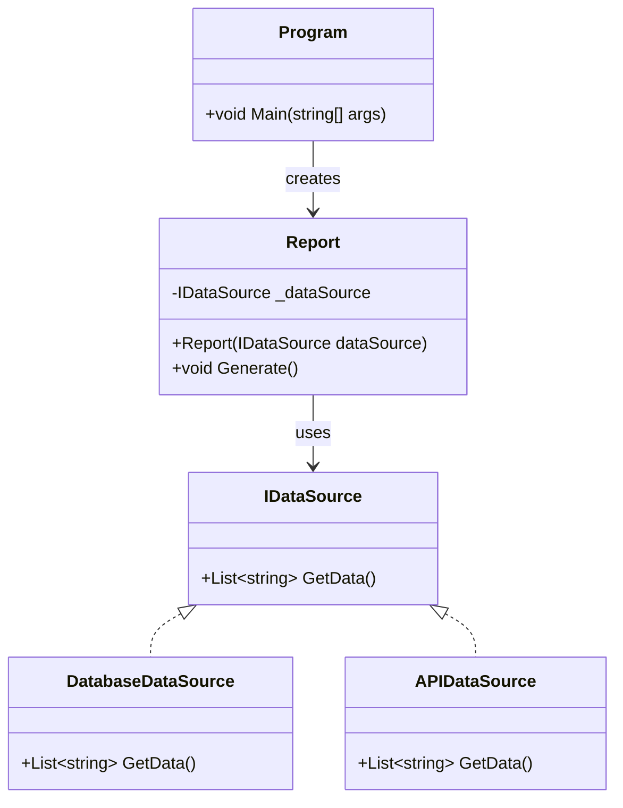
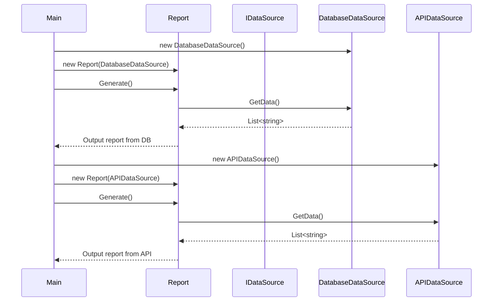

### Class Diagram

```mermaid
classDiagram
    class IDataSource {
        +List~string~ GetData()
    }

    class DatabaseDataSource {
        +List~string~ GetData()
    }

    class APIDataSource {
        +List~string~ GetData()
    }

    class Report {
        -IDataSource _dataSource
        +Report(IDataSource dataSource)
        +void Generate()
    }

    class Program {
        +void Main(string[] args)
    }

    IDataSource <|.. DatabaseDataSource
    IDataSource <|.. APIDataSource
    Report --> IDataSource : uses
    Program --> Report : creates
```

### Sequence Diagram

```mermaid
sequenceDiagram
    participant Main
    participant Report
    participant IDataSource
    participant DatabaseDataSource
    participant APIDataSource

    Main->>DatabaseDataSource: new DatabaseDataSource()
    Main->>Report: new Report(DatabaseDataSource)
    Main->>Report: Generate()
    Report->>DatabaseDataSource: GetData()
    DatabaseDataSource-->>Report: List<string>
    Report-->>Main: Output report from DB

    Main->>APIDataSource: new APIDataSource()
    Main->>Report: new Report(APIDataSource)
    Main->>Report: Generate()
    Report->>APIDataSource: GetData()
    APIDataSource-->>Report: List<string>
    Report-->>Main: Output report from API
```